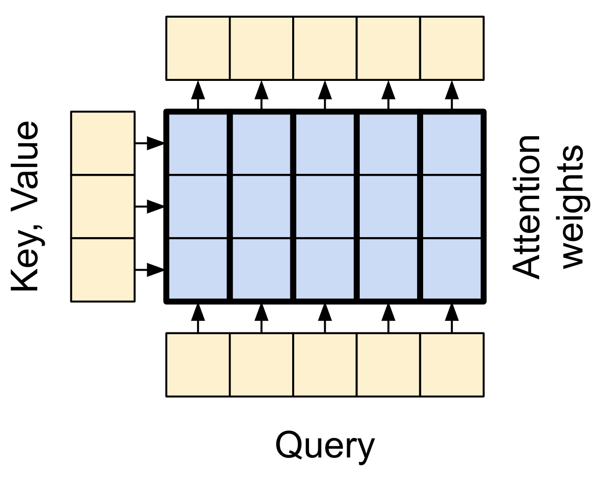

<!--
 Copyright (c) 2022 Victor I. Afolabi

 This software is released under the MIT License.
 https://opensource.org/licenses/MIT
-->

# Transformer

[](https://github.com/victor-iyi/transformer/actions/workflows/ci.yaml)
[](https://results.pre-commit.ci/latest/github/victor-iyi/transformer/main)

A TensorFlow implementation of the Transformer model.

The Transformer model was originally proposed in ["Attention is all you need"]
by *Vaswani et al. (2017)*. Transformers are the current state-of-the-art in
Natural Language tasks. Transformers are deep neural networks that replace CNNs
and RNNs with [self-attention]. Self attention allows Transformers to easily
transmit information across the input sequences, and it can all be done in parallel.


## What Transformer brings to the table

Neural networks for machine translation typically contains an encoder reading the
input sentence and generating a representation of it. A decoder then generates the
output sentence word by word while consulting the representation generated by the
encoder. The Transformer starts by generating initial representations, or embeddings,
for each word... Then, using self-attention, it aggregates information from all
of the other words, generating a new representation per word informed by the
entire context. This step is then repeated multiple times in parallel for all words,
successively generating new representations.


*Source: [Google AI Blog]*

## Setup

The `Transformer` class has a simple API.

```python
transformer = Transformer(
  num_layers=5,
  d_model=512,
  dff=2048,
  input_vocab_size=10_000,
  target_vocab_size=10_000,
  dropout=0.2,
)

output = transformer((target_token, input_token))
```

The architecture is made up of some two essential layers:

- `Encoder`: The encoder consists of a `PositionalEmbedding` to encode the position
of the embedding representation in the data rather than the model itself and a
stack of `EncoderLayer`s.
  - The `EncoderLayer` consists of a `GlobalSelfAttention` and `FeedForward` layer.
  The `GlobalSelfAttention` enables every sequence element directly access every
  other sequence element, with only a few operations and can be computed in parallel.
  While the `FeedForward` layer performs a series of linear transformation on the
  attention output with residual connections.

- `Decoder`: The decoder contains a `PositionalEmbedding` and a stack of
`DecoderLayer`s. The `PositionalEmbedding` performs the same function as the encoder's
-- it keeps the positional context of each token in the output embedding, while
the `DecoderLayer` consists of both `CausalSelfAttention` and `CrossAttention` with
a `FeedForward` layer that performs a linear transformation as explained earlier.
  - The `CausalSelfAttention` allows for auto-regressive output as the outputs
  are generated auto-regressively, while the `CrossAttention` connects the encoder
  and decoder.

## Attention refresher

Here's a top-level explaination of how attention works.

There are two inputs:

1. The query sequence; the sequence being processed; the sequence doing the attending
(bottom).

1. The context sequence; the sequence being attended to (left).



The output has the same shape as the query-sequence.

Think of the attention operation as a dictionary lookup. A **fuzzy**, **differentiable**,
**vectorized** dictionary lookup.

Here's a regular Python dictionary, with 3 keys and 3 values being passed as a
single query.

```python
>>> d = {'color': 'blue', 'age': 22, 'type': 'pickup'}
>>> result = d['color']
>>> result
blue
```

- The `query` is what you're trying to find.
- The `key` is what sort of information the dictionary has.
- The `value` is that information.

When you lookup a `query` in a regular dictionary, the dictionary finds the matching
`key`, and returns its associated `value`. The `query` either has a matching `key`
or it doesn't. You can imagine a **fuzzy** dictionary where the keys don't have
to matchup perfectly. For example, if you looked up `d['species']` in the dictionary
above, maybe you'd want it to return `"pickup"`, since that's the best match for
the query.

An attention layer does a fuzzy lookup like this, but it's not just looking for
the best key. It combines the `values` based on how well the `query` matches each
`key`.

How does that work? In an attention layer the `query`, `key`, and `value` are
each vectors. Instead of doing a hash lookup, the attention layer combines the
`query` and `key` vectors to determine how well they match, the *"attention score"*.
The layer returns the average across all the `values`, weighted by the
*"attention scores"*.

## Further reading

- ["Attention is all you need"]
- [Google AI Blog] on Transformers:
- [Translate text with transformer models]

["Attention is all you need"]: https://arxiv.org/abs/1706.03762
[Google AI Blog]: https://ai.googleblog.com/2017/08/transformer-novel-neural-network.html
[Translate text with transformer models]: https://www.tensorflow.org/text/tutorials/transformer
[self-attention]: https://developers.google.com/machine-learning/glossary#self-attention

## Contribution

You are very welcome to modify and use them in your own projects.

Please keep a link to the [original repository]. If you have made a fork with
substantial modifications that you feel may be useful, then please [open a new
issue on GitHub][issues] with a link and short description.

## License (MIT)

This project is opened under the [MIT][license] which allows very
broad use for both private and commercial purposes.

A few of the images used for demonstration purposes may be under copyright.
These images are included under the "fair usage" laws.

[original repository]: https://github.com/victor-iyi/transformer
[issues]: https://github.com/victor-iyi/transformer/issues
[license]: ./LICENSE
