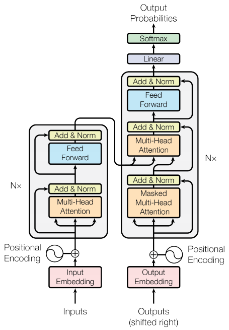

<!--
 Copyright (c) 2022 Victor I. Afolabi

 This software is released under the MIT License.
 https://opensource.org/licenses/MIT
-->

# Transformer

A TensorFlow implementation of the Transformer model.

## Contribution

You are very welcome to modify and use them in your own projects.

Please keep a link to the [original repository]. If you have made a fork with
substantial modifications that you feel may be useful, then please [open a new
issue on GitHub][issues] with a link and short description.

## License (MIT)

This project is opened under the [MIT][license] which allows very
broad use for both private and commercial purposes.

A few of the images used for demonstration purposes may be under copyright.
These images are included under the "fair usage" laws.

[original repository]: https://github.com/victor-iyi/transformer
[issues]: https://github.com/victor-iyi/transformer/issues
[license]: ./LICENSE
